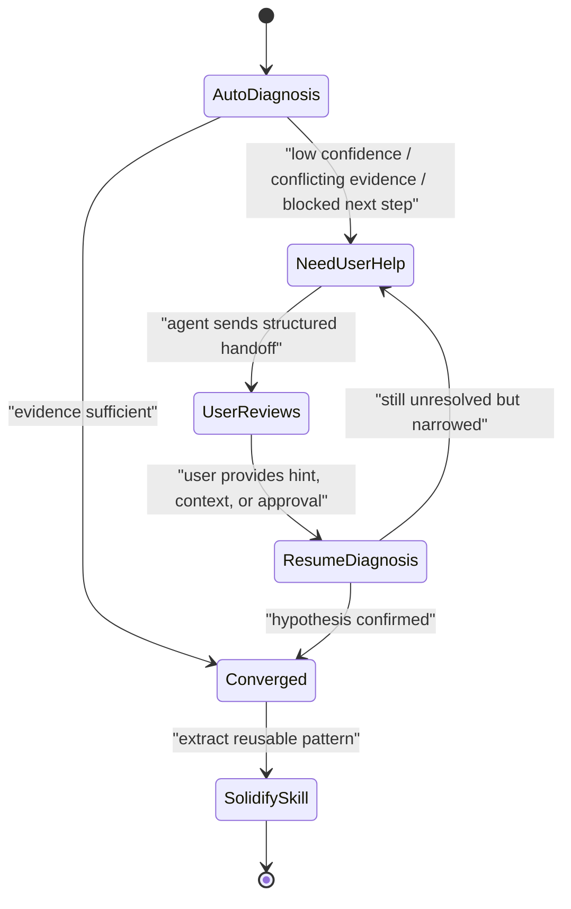

# Skill Agent 与用户联动的问题定位设计

本文档定义一条 `human-in-the-loop` 排障协议，目标是让基于 Skill 的诊断 Agent 在没有头绪时，不是继续盲查，而是把当前证据、缺口和下一步选择清晰交给用户，再根据用户反馈继续定位。

这份设计同时服务两个目标：

1. 让 Agent 在真实排障过程中知道什么时候该自动推进，什么时候该停下来请求用户协助。
2. 让协作过程可以被固化进 Skill，而不是每次重新发明一套“卡住时怎么问”的话术。

---

## 1. 设计目标

要解决的不是“Agent 能不能执行命令”，而是“Agent 在不确定时如何正确地请求人类帮助”。

设计目标有 5 个：

1. 让 Agent 默认先自主完成首轮定位。
2. 当系统证据不足时，强制进入结构化求助，而不是无边界扩散命令。
3. 让用户能快速看懂 Agent 已经查到哪里、还差什么。
4. 让用户给出的线索可以直接转化为下一轮定位动作。
5. 让一次成功的人机协作能沉淀为下次更强的 Skill 规则。

---

## 2. 适用场景

这套联动设计适用于以下情况：

- 系统层面证据不足以解释业务异常
- 日志很多，但需要用户指出真正异常的那一段
- Agent 已完成初轮采集，但根因置信度仍低
- 下一步需要业务上下文、发布时间、配置变更信息
- 下一步需要用户批准扩展命令范围或调整白名单

不适用于：

- 已经可以明确下结论的问题
- 纯连接失败、纯参数错误这类不需要业务上下文的问题

---

## 3. 角色分工

### 3.1 Skill Agent

职责：

- 自动登录或复用会话
- 执行首轮采集与分析
- 判断自己是否已经足够接近根因
- 在卡住时生成结构化求助信息
- 在用户回复后继续执行下一轮定位
- 在问题结束后总结可沉淀的 Skill 资产

### 3.2 用户

职责：

- 查看 Agent 提供的证据和日志摘要
- 补充业务背景、变更背景或目标行为
- 指出可疑日志或建议下一步方向
- 在需要时批准更高权限或更大范围的排查动作

### 3.3 DevUtility Hub

职责：

- 提供会话、命令执行、日志、`troubleshoot`、知识库召回能力
- 保存 run、会话日志和历史案例
- 作为人机协作的共享证据面

---

## 4. 联动状态机



关键点是：

- `NeedUserHelp` 不是失败，而是一个正式状态。
- Agent 一旦进入这个状态，就不应继续无目标地追加命令。
- 用户的回复不是“重新开始”，而是让 Agent 进入 `ResumeDiagnosis`。

---

## 5. 什么时候必须请求用户协助

建议把以下条件作为 Skill 内的强触发规则。

只要命中任一条件，Agent 就应停止盲查并请求用户协助：

1. 初轮 `troubleshoot` 或手工采集完成后，仍没有一个可辩护的根因假设。
2. 连续两轮 follow-up 命令都没有显著缩小问题范围。
3. 不同命令的输出互相矛盾。
4. 命令白名单拦住了下一步最有价值的探针。
5. 需要业务语义才能解释日志，例如租户、订单状态、特定客户行为。
6. 需要发布、变更、流量切换、开关配置等外部背景信息。
7. 用户明确表示要自己先看日志再决定下一步。

这几条的核心原则是：

`当缺的是上下文，不是缺命令时，就该找用户。`

---

## 6. Agent 向用户反馈的固定结构

Agent 进入 `NeedUserHelp` 后，输出不应是“我没头绪”，而应是标准化求助包。

建议固定为 5 段：

1. `当前现象`
   当前到底坏了什么。
2. `已确认的证据`
   哪些命令、日志、run 已经证明了什么。
3. `仍未解释的缺口`
   当前证据还解释不了什么。
4. `需要用户提供什么`
   需要业务背景、可疑日志、范围纠正，还是动作批准。
5. `收到回复后的下一步`
   Agent 计划基于用户回复执行什么验证动作。

建议输出模板：

```text
当前现象：
- <故障摘要>

已确认的证据：
- <证据 1>
- <证据 2>

仍未解释的缺口：
- <为什么现在还不能下结论>

需要你提供：
- <业务背景 / 可疑日志关键词 / 发布变更信息 / 是否批准下一步命令>

收到你的回复后，我会：
- <1 到 3 个聚焦的后续验证动作>
```

---

## 7. 用户可介入的 4 种方式

用户不一定需要懂所有底层命令，但至少要能通过以下 4 种方式给 Agent 有效输入。

### 7.1 补充业务背景

例如：

- “这个问题只发生在新租户”
- “今天上午刚升级了支付 SDK”
- “只有灰度节点有问题”

### 7.2 指出日志中的可疑线索

例如：

- “你重点搜 `merchant not found`”
- “这段 `tenant mismatch` 看起来不对”

### 7.3 纠正排查范围

例如：

- “不要看订单服务，应该看支付网关”
- “这不是单机问题，应该查入口 SLB 后端”

### 7.4 批准下一步动作

例如：

- “可以临时放开 `kubectl`”
- “可以追加只读 DB 查询”

---

## 8. Agent 如何基于用户回复继续定位

用户回复后，Agent 不能简单重复上一次总结，而应进入一个严格的恢复流程：

1. 把用户输入改写成一个明确假设。
2. 优先复用当前 `sessionId`，保留现场上下文。
3. 只执行能验证该假设的最小命令集，通常 1 到 3 条。
4. 明确说明新增证据与上一轮相比发生了什么变化。
5. 判断：
   - 假设成立，则收敛根因。
   - 假设不成立，则说明为什么不成立。
   - 仍不充分，则再进入一轮 `NeedUserHelp`，但必须比上一轮更窄。

这里的关键约束是：

`一条用户线索，只换来一小轮验证，而不是一大波发散式命令。`

---

## 9. 推荐的人机协同问答协议

适合写入 Skill 的协议如下。

### 9.1 首轮自动排查

Agent 先自主完成：

- 历史案例召回
- `troubleshoot` 或首轮手工采集
- 初始 findings 和 report

### 9.2 卡住后向用户反馈

Agent 输出：

- 当前症状
- 已查证据
- 未解释点
- 需要用户补什么
- 收到回复后的计划

### 9.3 用户接力

用户可选择：

- 补充背景
- 指出关键词
- 指定下一步方向
- 批准扩大排查范围

### 9.4 Agent 继续定位

Agent：

- 复用 session
- 跑最小验证命令
- 返回增量结论

### 9.5 闭环

问题解决后，Agent 需要额外输出：

- 哪些命令值得复用
- 哪些分析规则值得固化
- 哪些用户问题下次应该更早提

---

## 10. 如何固化到 Skill 中

这部分是关键。不是所有 incident 都应该直接写进 Skill，但以下内容应优先沉淀：

1. 常见卡点的触发条件
2. Agent 求助用户时的输出模板
3. 用户回复后的恢复流程
4. 典型问题域的提问清单
5. 常见日志关键词到下一步命令的映射

建议沉淀位置如下：

- 通用协作规则：写入 Skill 主体 `SKILL.md`
- 详细升级条件和模板：写入 `references/human-collaboration.md`
- 可直接复用的协作 prompt：写入 `references/invocation-templates*.md`
- 具体历史案例：写入知识库，而不是 Skill 正文

换句话说：

- Skill 负责“方法”
- KB 负责“案例”

---

## 11. 对当前 DevUtility Agent Diagnosis Skill 的落地建议

当前最合适的落地方向是：

1. 在 Skill 主文档中加入 `NeedUserHelp` 状态。
2. 在引用文档中加入固定求助模板和恢复协议。
3. 在调用模板中加入“协作式排障”模板。
4. 在后续 incident 复盘时，优先从“用户补的哪类信息最有用”反向优化 Skill。

这样一来，Skill Agent 就不再只是“会执行命令”，而是具备：

- 自动推进能力
- 自知卡住能力
- 向用户高质量求助能力
- 用户回复后的恢复能力
- 经验沉淀能力

---

## 12. 一句话原则

这套设计的原则可以压缩成一句话：

`Agent 负责自动化证据采集和初步收敛，用户负责补齐系统之外的关键上下文；Skill 负责把这种协作方式固定下来。`
