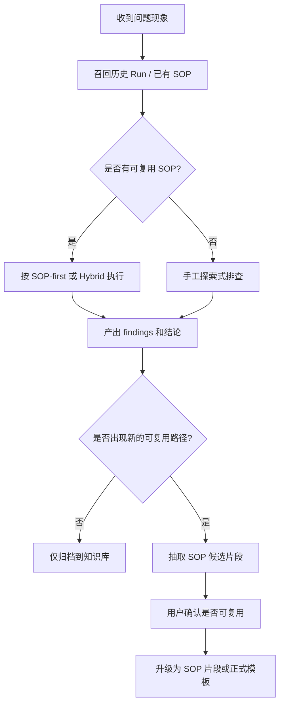

# Agent 的 SOP 理解与渐进式固化设计

本文档定义 Agent 如何把 SOP 从“静态模板”升级成“诊断加速器”。

目标不是只让 Agent 会执行 SOP，而是让 Agent 具备 3 类能力：

1. 读懂 SOP 在解决什么问题。
2. 知道什么时候应该优先使用 SOP，什么时候应脱离 SOP 做探索。
3. 能把一次成功的新定位路径渐进式固化回 SOP，减少下次排查成本。

---

## 1. 为什么 Agent 需要理解 SOP

如果 Agent 只会自由执行命令，会有 3 个问题：

1. 每次都从零开始推理，排查时间长。
2. 容易偏离历史上已经证明有效的路径。
3. 好的排查经验沉淀不到下一次，诊断质量不稳定。

SOP 的价值不只是复用命令，更重要的是复用：

- 症状分类
- 变量定义
- 证据提取方式
- 正常与异常判定标准
- 排查顺序
- 需要人工介入的检查点

所以 Agent 需要理解 SOP 的“结构”和“意图”，而不只是把它当 shell 脚本顺序执行。

---

## 2. Agent 需要具备的 SOP 能力

### 2.1 结构理解能力

Agent 需要能理解一个 SOP 模板至少包含：

- `name`
- `category`
- `description`
- `diagnosisHints`
- `variables[]`
- `checks[]`
- `subSteps[]`
- `captureVar`
- `capturePattern`
- `normalRegex`
- `abnormalRegex`

也就是说，Agent 需要知道：

- 这个 SOP 适用于什么问题
- 执行前需要哪些输入
- 每个检查步骤的目标是什么
- 哪些输出是需要提取出来继续传递的
- 哪些正则是正常信号，哪些是异常信号

### 2.2 策略选择能力

Agent 要能在 3 种模式中切换：

1. `SOP-first`
   已有 SOP 非常匹配，优先按 SOP 执行。
2. `Hybrid`
   先用 SOP 跑公共部分，再用自由命令补新分支。
3. `Manual-first`
   没有合适 SOP，先探索，再考虑沉淀。

### 2.3 演进固化能力

Agent 不能把新经验只留在一次性的 run 里，而要能判断：

- 哪个新步骤值得复用
- 哪个新正则值得加入 SOP
- 哪个用户问题下次应该更早问
- 是更新现有 SOP，还是新增一个新 SOP

---

## 3. SOP 驱动排障的推荐流程



这条链路里，知识库和 SOP 分工不同：

- 知识库保存“案例”
- SOP 保存“方法”

---

## 4. 什么时候优先走 SOP

建议 Agent 命中以下条件时优先走 SOP：

1. 症状明显属于某个已知问题域。
   例如服务不可用、慢响应、网络故障、存储异常。
2. 历史知识库显示已有多个相似案例共享相同早期检查步骤。
3. 当前环境高风险，不适合大量自由探索命令。
4. 用户明确要求“按既有 SOP 排查”。

如果命中的是“同问题域但本次多了新分支”，则应采用 `Hybrid`：

- 先跑 SOP 的公共部分
- 再补充最小自由命令
- 最后把这条新分支评估是否固化回 SOP

---

## 5. 什么时候不应被 SOP 绑死

以下情况不应强行套 SOP：

1. 当前症状明显是新型问题，SOP 只能覆盖很小一部分。
2. SOP 结论和现场证据冲突。
3. 用户指出可疑点在 SOP 覆盖范围之外。
4. 当前只需要验证一个很小的假设，用完整 SOP 反而冗长。

原则是：

`SOP 应该减少探索成本，而不是限制判断。`

---

## 6. 渐进式固化模型

不要把 SOP 固化理解成“必须一次写出完整模板”。更有效的是分级固化。

### Level 0: 临时探索

只有手工命令、临时假设、用户提示。

### Level 1: 候选定位笔记

当一次探索有效时，先抽取：

- 症状
- 关键命令
- 关键证据
- 下一步判断逻辑

这时还不一定形成 SOP，只是一个候选路径。

### Level 2: SOP 片段

把可复用的最小单元固化下来，例如：

- 一个检查步骤
- 一组串联子步骤
- 一个变量捕获规则
- 一对正常/异常正则
- 一段根因提示

### Level 3: 现有 SOP 增量更新

如果已有 SOP 只差一小段，就把 Level 2 片段合并进去。

### Level 4: 新 SOP 模板

当新的问题域已经形成稳定的排查入口、变量、证据和结论逻辑时，再提升为新 SOP。

这种设计的重点是：

`先固化最小可复用单元，再追求完整 SOP。`

---

## 7. 哪些内容适合固化到 SOP

优先固化：

- 稳定的首轮检查路径
- 经常重复出现的变量
- 规律明显的日志关键词
- 可用正则稳定判定的正常/异常输出
- 反复需要用户补充的背景问题
- 多次 incident 中都有效的下一步选择逻辑

不适合直接固化：

- 某个节点独有的偶发脏数据
- 太依赖某次发布背景的临时 workaround
- 没有稳定解释力的大段原始日志
- 高风险或强交互命令

---

## 8. 用户在 SOP 演进中的作用

SOP 不应该由 Agent 单方面写死。用户要参与两类确认：

### 8.1 可复用性确认

用户确认：

- 这个路径是否真的重复出现过
- 这个步骤是否只适用于某一个租户、节点或版本
- 这个提示是否具有业务普适性

### 8.2 边界确认

用户确认：

- 哪一步必须保留人工判断
- 哪一步可以自动化
- 哪些命令虽然有效，但不应进入默认 SOP

因此，Agent 输出 SOP 建议时，不应只说“建议新增 SOP”，而应给出：

- 复用了哪个旧 SOP
- 新增了什么片段
- 为什么它值得复用
- 哪些地方仍需要人工确认

---

## 9. 对 Skill 的要求

要让 Agent 真正具备 SOP 理解和演进能力，Skill 至少要明确 4 类规则：

1. `SOP 选择规则`
   什么时候 SOP-first，什么时候 Hybrid，什么时候 Manual-first。
2. `SOP 解读规则`
   如何读取变量、检查、子步骤、正则、提示。
3. `SOP 求助规则`
   当 SOP 不足时，如何向用户说明“旧 SOP 覆盖到哪里，新问题从哪里开始”。
4. `SOP 固化规则`
   当一次排查成功后，如何提出 SOP 候选更新。

---

## 10. 对产品能力的要求

当前仓库已经有这些基础：

- SOP 模板结构定义
- Markdown 导入导出
- UI 执行与报告
- 服务端 `exec_plan`

但要让 Agent 真正端到端 SOP 化，后续最好补 MCP 能力：

1. `list_sop_templates`
2. `get_sop_template`
3. `run_sop`
4. `save_sop_candidate`
5. `promote_sop_candidate`

目前这部分还属于设计目标，不是现有 MCP 运行时保证。

---

## 11. 推荐的 Agent 输出补充项

当一次诊断结束且存在 SOP 价值时，Agent 额外输出：

1. `reusedSop`
   本次复用了哪个 SOP 或哪个片段。
2. `sopGap`
   现有 SOP 缺了什么。
3. `candidateSolidification`
   建议固化的变量、步骤、正则、提示。
4. `requiresHumanReview`
   哪些候选内容必须由用户确认。

示例：

```json
{
  "reusedSop": "service-unavailable",
  "sopGap": [
    "缺少对 payment-gateway timeout 的下游连通性检查"
  ],
  "candidateSolidification": [
    "新增 check: payment gateway connectivity",
    "新增 abnormalRegex: timeout|upstream timed out",
    "新增 diagnosisHint: 发布后若 gateway timeout 集中出现，先排查下游连接"
  ],
  "requiresHumanReview": [
    "该问题是否只在灰度环境出现",
    "该 regex 是否会误伤其他正常超时日志"
  ]
}
```

---

## 12. 一句话原则

这套设计可以归纳成一句话：

`Agent 先用 SOP 缩短路径，再用探索补足新分支，最后把验证过的新分支逐步固化回 SOP。`
