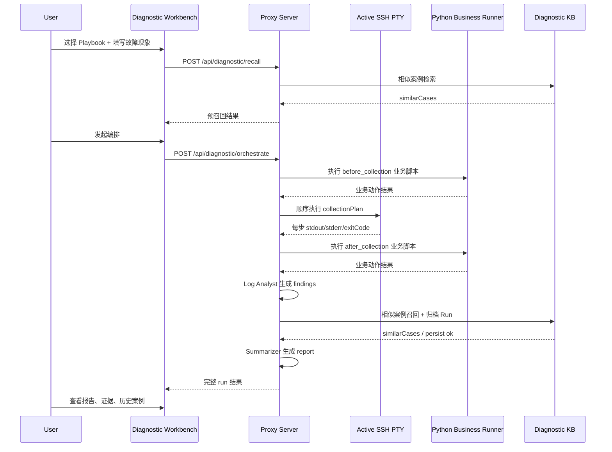

# 基于 Agent 的问题定位端到端工作流

本文档端到端描述 DevUtility Hub 中，如何基于 Agent 编排完成一次完整的问题定位闭环。

目标不是只解释单个接口，而是说明一条真实工作流：

1. 问题如何进入系统
2. Agent 如何分工
3. 现场如何采集
4. 日志如何分析
5. 结论如何归纳
6. 结果如何归档与召回
7. 人如何接管与闭环

---

## 1. 适用范围

本工作流适用于以下场景：

- 服务超时、502/503、连接拒绝
- 节点异常、进程退出、资源耗尽
- 业务链路回归验证
- 多节点环境下的快速现场采集与总结

当前实现基于以下能力组合：

- `SSH Manager` 维护活动 SSH 会话
- `Agent API` 复用活动 PTY 执行命令
- `Diagnostic Workbench` 组织编排和展示结果
- `Python Business Runner` 执行业务测试/控制脚本
- `Diagnostic KB` 持久化历史 Run 并做相似召回

---

## 2. 参与角色

### 2.1 人工操作者

职责：

- 建立 SSH 会话
- 选择诊断 Playbook
- 填写故障现象
- 审阅 Agent 输出
- 执行最终修复动作

### 2.2 Collector Agent

职责：

- 连接现场
- 顺序执行采集命令
- 保留执行上下文
- 记录命令、输出、退出码、耗时

### 2.3 Log Analyst Agent

职责：

- 对采集结果应用分析规则
- 提取错误特征和证据
- 形成结构化 findings

### 2.4 Report Summarizer Agent

职责：

- 汇总采集、分析、相似案例
- 给出摘要、根因假设、建议动作、下一步

### 2.5 Business Test Runner

职责：

- 通过 Python 脚本做业务控制和业务验证
- 可在采集前或采集后运行

---

## 3. 系统组成

前端：

- [src/modules/DiagnosticWorkbench/index.tsx](/Users/kafaz/dev/dev_utils/devutility-hub/src/modules/DiagnosticWorkbench/index.tsx)
- [src/modules/DiagnosticWorkbench/store/diagnosticStore.ts](/Users/kafaz/dev/dev_utils/devutility-hub/src/modules/DiagnosticWorkbench/store/diagnosticStore.ts)

后端：

- [server/index.js](/Users/kafaz/dev/dev_utils/devutility-hub/server/index.js)
- [server/diagnosticKb.js](/Users/kafaz/dev/dev_utils/devutility-hub/server/diagnosticKb.js)

示例业务脚本：

- [server/examples/business_smoke_test.py](/Users/kafaz/dev/dev_utils/devutility-hub/server/examples/business_smoke_test.py)

知识库存储：

- `server/data/diagnostic-kb.json`

---

## 4. 端到端主流程

## 4.1 总览

---

## 5. 详细流程

## 5.1 第 0 步：建立 SSH 会话

当前支持两种方式：

1. 人工先在 `SSH Manager` 中建立会话
2. 外部 Agent 通过登录预设调用 `POST /api/agent/connect` 自动建立会话

前置条件是：

1. 目标节点的登录信息已存在于 `SSH Manager` 会话或服务端登录预设中
2. 会话进入 `global.activeSessions`
3. 后端可通过 `GET /api/agent/sessions` 发现该会话

这样设计的原因是：

- 复用用户已建立好的认证和网络路径
- 继承当前 shell 上下文
- 在需要自动化时，也能通过预设复用固定密钥、密码或 SSH Agent

当前可复用的上下文包括：

- `sudo su` 之后的身份
- `cd` 之后的工作目录
- `source` 后的环境变量
- 堡垒机跳转后的网络上下文

---

## 5.2 第 1 步：定义问题和 Playbook

在 `Diagnostic Workbench` 中，用户需要提供：

- `title`
- `symptom`
- `notes`
- `sessionId`
- `collectionPlan[]`
- `analysisRules[]`
- `businessActions[]`

其中：

- `collectionPlan[]` 定义 Collector Agent 要执行的远程命令
- `analysisRules[]` 定义 Log Analyst Agent 的匹配规则
- `businessActions[]` 定义 Python 业务测试动作

这是整个工作流的输入面。

如果输入不完整，后端不会让编排继续。例如：

- 没有 `title` 或 `symptom`
- 既没有采集步骤，也没有业务动作
- 有采集步骤但没有可用的 SSH 会话

---

## 5.3 第 2 步：预召回历史案例

用户发起编排前，前端通常会先调用：

- `POST /api/diagnostic/recall`

输入：

- 故障现象
- 采集步骤
- 业务动作

后端会从历史知识库中提取三类信号：

- `symptomKeywords`
- `findingKeywords`
- `commandKeywords`

然后对历史 Run 计算相似度。

当前采用可解释加权策略：

- 症状词：0.45
- 错误关键词：0.35
- 命令关键词：0.20

这个阶段的作用不是“给出结论”，而是让用户在执行前看到：

- 过去有没有类似问题
- 曾经哪些命令和结论比较有效

---

## 5.4 第 3 步：启动编排

用户确认后，前端或外部 Agent 调用：

- `POST /api/diagnostic/orchestrate`

对于单 Agent MVP，也可以直接调用：

- `POST /api/agent/troubleshoot`

这是整条问题定位链路的主入口。

它把一次诊断拆成四个阶段：

1. `before_collection` 业务动作
2. 远程现场采集
3. `after_collection` 业务动作
4. 分析、归纳、归档

---

## 5.5 第 4 步：执行 before_collection 业务动作

如果 Playbook 中配置了业务测试动作，且 `runMode = before_collection`，后端会先本地执行 Python 脚本。

执行器特征：

- 使用 `python3` 启动脚本
- 支持 `args[]`
- 支持通过 `stdinPayload` 传入 JSON 或纯文本
- 记录 `stdout`、`stderr`、`exitCode`、`durationMs`

适用动作示例：

- 登录冒烟
- 下单接口探测
- 健康检查请求
- 灰度验证前置触发

这一步的核心价值是先主动触发业务，再带着现场采集进入真正的问题定位。

---

## 5.6 第 5 步：Collector Agent 执行远程采集

Collector Agent 按 `collectionPlan[]` 顺序执行命令。

执行方式：

- 不新建独立 SSH `exec` 通道
- 直接复用活动 Shell PTY
- 通过命令队列串行执行

这样做的价值是保持上下文连续，避免以下问题：

- 新开通道丢失 `cwd`
- 新开通道丢失 `sudo` 身份
- 新开通道丢失环境变量

每个采集步骤都会记录：

- `name`
- `command`
- `resolvedCommand`
- `stdout`
- `stderr`
- `exitCode`
- `durationMs`
- `status`
- `conclusion`

这部分结果组成 `collectionSteps[]`，是后续分析的核心输入。

---

## 5.7 第 6 步：执行 after_collection 业务动作

如果业务脚本配置为 `runMode = after_collection`，则在现场采集完成后执行。

典型用途：

- 修复后回归
- 降级动作后的验证
- 对比采集前后的业务响应
- 用同一业务请求再次复现问题

这样可以把“业务验证”和“现场采集”放进一次同源 Run 中，避免人工在系统外散落记录。

---

## 5.8 第 7 步：Log Analyst Agent 生成 findings

在采集和业务动作都完成后，Log Analyst Agent 开始工作。

它的输入包括：

- `collectionSteps[]`
- `businessActions[]`
- `analysisRules[]`

分析分为两层：

### A. 显式规则匹配

根据用户配置的规则，对 `stdout` / `stderr` / 全量文本做正则匹配。

规则结构：

- `name`
- `pattern`
- `source`
- `severity`
- `summary`

### B. 启发式特征识别

如果没有足够规则，系统还会做基础启发式识别，例如：

- `oom`
- `timeout`
- `connection refused`
- `exception`
- `panic`
- `fatal`
- 非零退出码

最终输出 `findings[]`，每条 finding 包含：

- 标题
- 严重级别
- 摘要
- 证据片段
- 来源步骤

---

## 5.9 第 8 步：召回历史知识库

在本次 findings 生成后，系统会再次做历史相似案例召回。

和预召回相比，这次召回质量更高，因为输入增加了：

- 真实命令输出
- 真实 findings
- 更准确的错误关键词

召回结果会返回：

- `runId`
- `title`
- `score`
- `matchedSignals[]`
- `reportSummary`
- `topFindings[]`

这些结果会直接进入报告归纳阶段。

---

## 5.10 第 9 步：Report Summarizer Agent 生成报告

Report Summarizer Agent 不直接读取原始现场，而是汇总上游结果：

- 采集结果
- 业务动作结果
- findings
- 相似案例
- 用户备注

输出 `report`，主要包含：

- `summary`
- `rootCauseHypothesis`
- `recommendations[]`
- `nextActions[]`
- `similarCaseHint`

这一步的目标不是给出“绝对真相”，而是输出一个足够结构化、可追溯、可执行的排查摘要。

---

## 5.11 第 10 步：归档到知识库

当本次 Run 完成后，后端会把完整结果持久化到：

- `server/data/diagnostic-kb.json`

归档内容包括：

- 问题输入
- 会话信息
- 采集步骤结果
- 业务脚本结果
- findings
- similarCases
- report
- signals

这一步让问题定位从“一次性的临场处理”变成“可复用的组织知识”。

---

## 5.12 第 11 步：人工审阅与闭环

当前系统设计里，最终修复动作仍由人工控制。

人工需要基于报告做三件事：

1. 判断当前根因假设是否成立
2. 执行修复、回滚、降级或扩容
3. 再次运行业务测试脚本和采集链路验证恢复情况

也就是说，Agent 负责：

- 快速采集
- 快速归纳
- 快速召回经验

而人负责：

- 最终决策
- 风险把控
- 修复执行

这是当前阶段最稳妥的边界。

---

## 6. 关键接口在工作流中的位置

### 6.1 会话发现

- `GET /api/agent/sessions`

作用：

- 找到当前已经连接的节点
- 供前端选择 `sessionId`

### 6.2 单命令执行

- `POST /api/agent/execute`

作用：

- 对外暴露最小可用的 Agent 命令执行能力
- 更适合外部 Agent 或轻量自动化调用

### 6.3 预召回

- `POST /api/diagnostic/recall`

作用：

- 编排前先看历史相似案例

### 6.4 主编排入口

- `POST /api/diagnostic/orchestrate`

作用：

- 跑完整问题定位链路
- 返回完整 Run

### 6.5 历史结果查看

- `GET /api/diagnostic/runs`
- `GET /api/diagnostic/runs/:id`

作用：

- 展示知识库中的归档 Run
- 用于复盘和二次召回

---

## 7. 一次真实 Run 的数据流

一次 Run 的数据流可以概括为：

`用户输入`
-> `预召回`
-> `before_collection 业务动作`
-> `远程采集`
-> `after_collection 业务动作`
-> `规则分析`
-> `启发式分析`
-> `历史召回`
-> `报告归纳`
-> `知识库归档`

其中最关键的两个中间产物是：

### 7.1 collectionSteps

这是“现场事实层”。

没有这层，后面的分析和报告都只是空推理。

### 7.2 findings

这是“结构化判断层”。

没有这层，知识库只能保存原始日志，无法高质量召回。

---

## 8. 失败处理

工作流中允许部分步骤失败，不要求全链路全成功。

### 8.1 业务脚本失败

处理方式：

- 记录失败结果
- 继续后续流程
- 在 findings 和 report 中体现

### 8.2 某个采集步骤失败

处理方式：

- 记录该步骤 `exitCode != 0`
- 继续后续采集
- 在 findings 中生成高优先级提示

### 8.3 没有召回到历史案例

处理方式：

- 不中断流程
- 报告中标记“暂无高相似历史案例”

### 8.4 分析规则未命中

处理方式：

- 回退到启发式分析
- 允许生成“当前未形成明确根因假设”的报告

这保证了系统在现场信息不完整时也能给出最小可用结果。

---

## 9. 安全与边界

当前实现对远程命令执行有黑名单保护，阻止明显破坏性命令，例如：

- `rm -rf`
- `mkfs`
- `dd if=`
- `reboot`
- `shutdown`

这意味着系统当前定位为：

- 诊断辅助系统
- 证据采集系统
- 经验沉淀系统

而不是自动修复平台。

如果未来要往自动修复走，必须补齐：

- 更细权限模型
- 命令审批
- 风险分级
- 回滚策略

---

## 10. 推荐使用方式

在真实团队里，建议按下面方式落地：

1. 先为高频问题维护 3 到 5 个 Playbook
2. 每个 Playbook 至少配 3 条采集命令
3. 每个 Playbook 至少配 2 条分析规则
4. 给关键业务链路准备 1 个 Python 冒烟脚本
5. 每次问题处理后都回看归档 Run，补齐规则和模板

这样知识库质量会越来越高，后续召回也会越来越准。

---

## 11. 当前实现对应关系

端到端工作流已经落地到以下代码：

- 编排与历史展示：
  [src/modules/DiagnosticWorkbench/index.tsx](/Users/kafaz/dev/dev_utils/devutility-hub/src/modules/DiagnosticWorkbench/index.tsx)
- Playbook 持久化：
  [src/modules/DiagnosticWorkbench/store/diagnosticStore.ts](/Users/kafaz/dev/dev_utils/devutility-hub/src/modules/DiagnosticWorkbench/store/diagnosticStore.ts)
- 编排 API、业务脚本执行、知识库接口：
  [server/index.js](/Users/kafaz/dev/dev_utils/devutility-hub/server/index.js)
- 召回与报告归纳逻辑：
  [server/diagnosticKb.js](/Users/kafaz/dev/dev_utils/devutility-hub/server/diagnosticKb.js)

---

## 12. 一句话总结

这个基于 Agent 的问题定位工作流，本质上是把一次故障处理拆成：

- 人提供问题上下文
- Agent 负责采集和归纳
- 知识库负责沉淀和召回
- 人负责最终修复与决策

这样既保留了现场控制力，又显著降低了重复排查成本。
